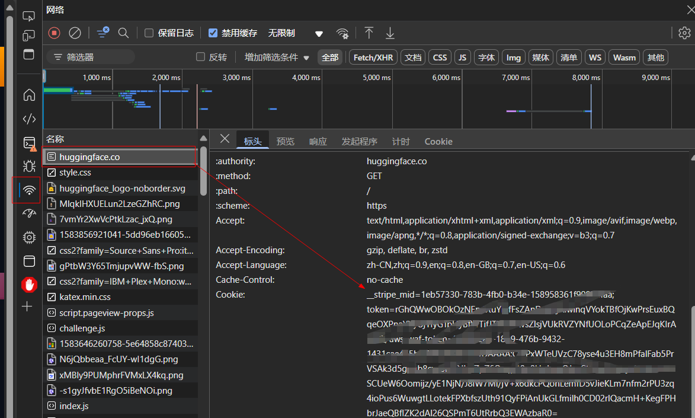
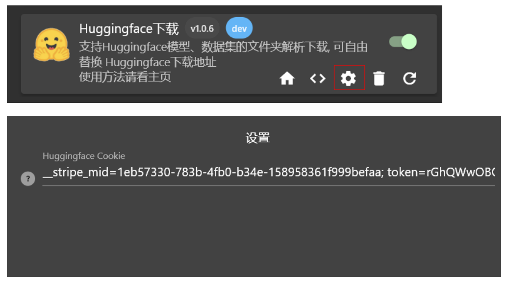

<!--
 * @Author: zayn 1546492103@qq.com
 * @Date: 2025-02-04 02:34:49
 * @LastEditors: zayn 1546492103@qq.com
 * @LastEditTime: 2025-02-25 12:13:36
 * @FilePath: \gopeed-extension-huggingface\README.md
 * @Description:
 *
-->

# Gopeed Extension Huggingface

## Feature

- ✅ 支持Huggingface的模型和数据集整个文件夹解析
- ✅ 支持解析huggingface.co || hf-mirror.com || www.modelscope.cn 上同名的模型和数据集, 并自由指定源站
- ✅ 支持递归解析，并自动创建文件夹
- ...

## Installation

在插件页面输入`https://github.com/DSYZayn/gopeed-extension-huggingface.git`下载即可安装

## Usage

满足以下格式的链接即可**解析该文件夹下所有文件**

`https://<baseUrl>/<user>/<repoType>/<repo>/tree/main/<path>`

- **baseUrl**: huggingface.co || hf-mirror.com || www.modelscope.cn
- **user**: 用户名(组织名), 如deepseek-ai
- **repoType**: models || datasets
- **path**: 文件夹路径， 如果是根目录则不填, 连同`main/`最后的`/`一起去掉

- 🔴 若要使用modelscope， 则需要该模型或数据集在huggingface中存在，否则无法解析。(modelscope缺少高效简洁的仓库元信息API接口，如确有需要的欢迎PR)
- ❗ 对于仓库内的单文件，则直接输入你手动获取的链接即可, 本插件不对单文件进行任何解析。
- 🤷‍♂️ 解析用时与目录深度和文件数量有关，通常在3s内可以完成大部分解析。

### Cookie Configuration

部分模型需要登录才能下载，这种情况下需要配置cookie，否则会出现`401`下载失败，配置方法如下：

1. 获取cookie，打开浏览器，登录`huggingface.co`，按`F12`打开开发者工具，切换到`Network`选项卡，刷新页面，找到`https://huggingface.co`的请求，复制`Cookie`字段的值
   

2. 在扩展设置中填入cookie
   

### Example

> 使用hf-mirror或modelscope下载则替换 `huggingface.co` 为 `hf-mirror.com` 或 `www.modelscope.cn`, 参考 `baseUrl`

1. 下载unsloth/DeepSeek-R1-GGUF的根目录文件：`https://huggingface.co/models/unsloth/DeepSeek-R1-GGUF/tree/main`
2. 下载unsloth/DeepSeek-R1-GGUF的`Deepseek-R1-BF16`文件夹：`https://huggingface.co/models/unsloth/DeepSeek-R1-GGUF/tree/main/Deepseek-R1-BF16`

tips: 以上两个链接中`models/`可以省略

1. 下载open-thoughts/OpenThoughts-114k的根目录文件：`https://huggingface.co/datasets/open-thoughts/OpenThoughts-114k/tree/main`
2. 下载open-thoughts/OpenThoughts-114k的`data`文件夹：`https://huggingface.co/datasets/open-thoughts/OpenThoughts-114k/tree/main/data`

tips: 以上两个链接中`datasets/`绝对不能省略

## Demo

<!-- markdownlint-disable MD033 -->

1.  Input `https://hf-mirror.com/models/unsloth/DeepSeek-R1-GGUF/tree/main`

2.  Input `https://hf-mirror.com/unsloth/DeepSeek-R1-GGUF/tree/main/DeepSeek-R1-BF16`

3.  Input `https://hf-mirror.com/datasets/rubenroy/GammaCorpus-CoT-Math-170k/tree/main`

4.  Input `https://hf-mirror.com/datasets/ServiceNow-AI/R1-Distill-SFT/tree/main/v1`

5.  Input `https://huggingface.co/KwaiVGI/LivePortrait/tree/main`

        

    <!-- markdownlint-disable MD033 -->

## Star History

