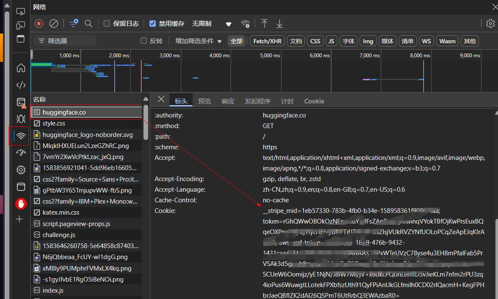
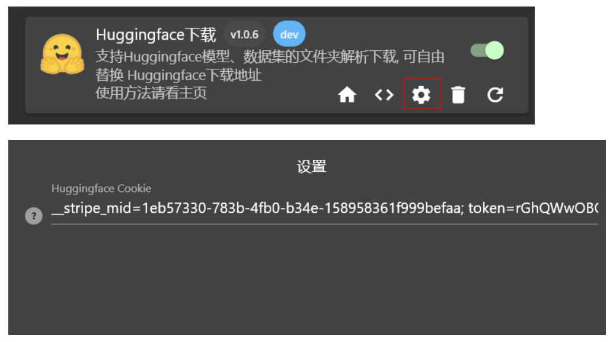
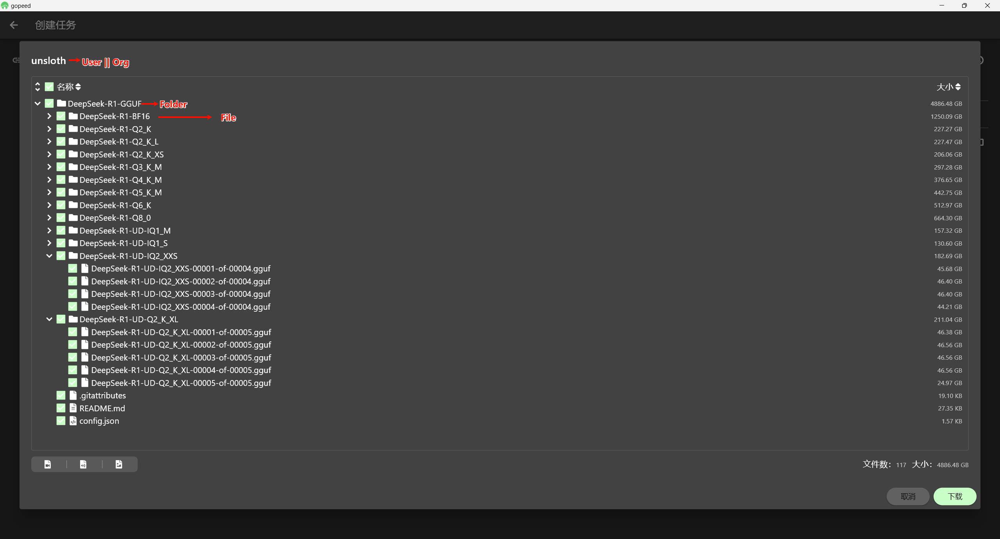
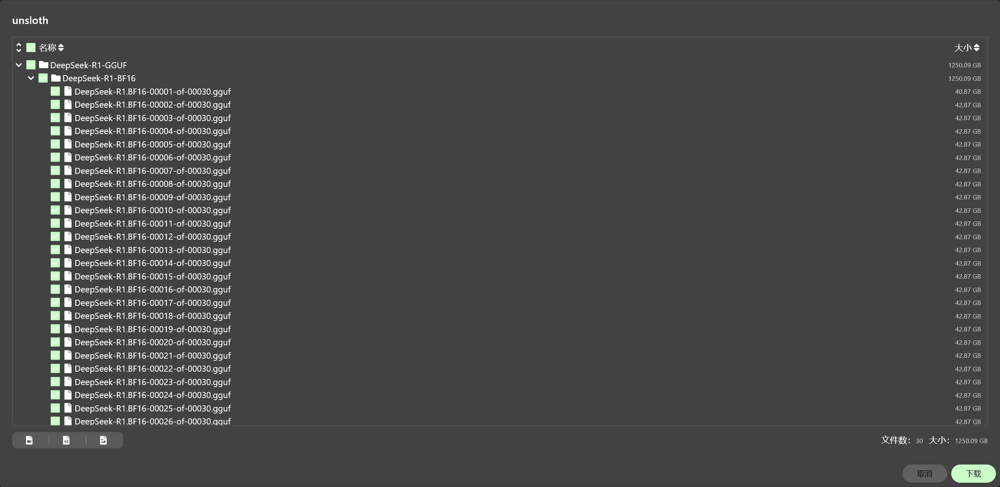
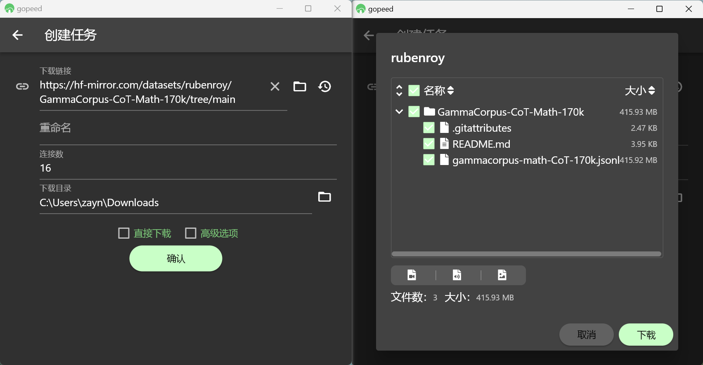
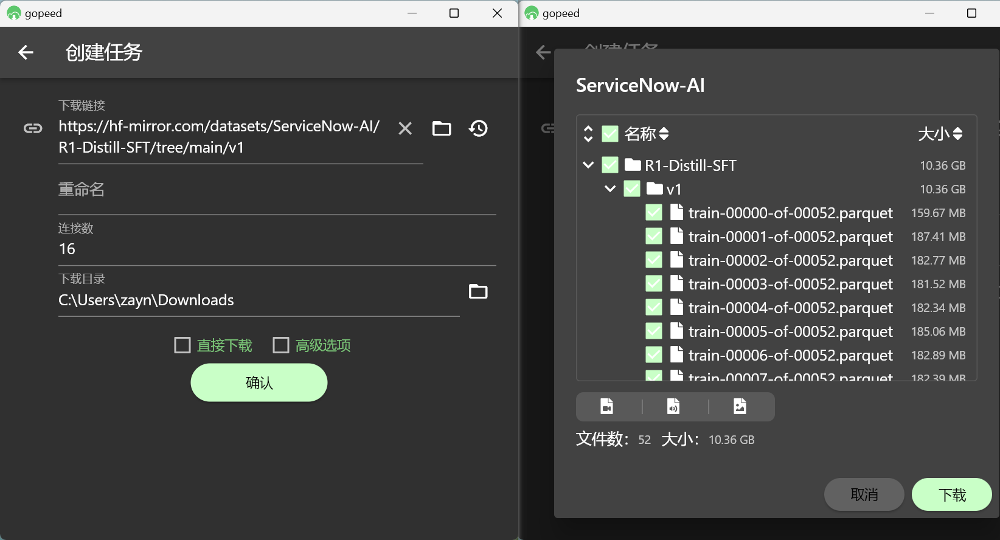
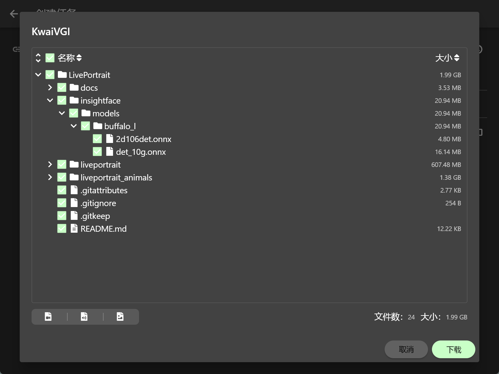

<!--
 * @Author: zayn 1546492103@qq.com
 * @Date: 2025-02-04 02:34:49
 * @LastEditors: zayn 1546492103@qq.com
 * @LastEditTime: 2025-02-25 12:13:36
 * @FilePath: \gopeed-extension-huggingface\README.md
 * @Description:
 *
-->

# Gopeed Extension Huggingface

[简体中文](readme/README.zh-CN.md) | [繁体中文](readme/README.zh-TW.md) | [English](README.md)

## Features

- ✅ Supports parsing entire folders of Huggingface models and datasets
- ✅ Supports parsing models and datasets with the same name on huggingface.co || hf-mirror.com || www.modelscope.cn, and freely specifying the source station
- ✅ Supports recursive parsing and automatically creates folders
- ✅ Supports setting Cookie to download Gated Repo
- ✅ Supports user-defined custom hf-mirror-compatible endpoints
- ✅ Supports `model:` private protocol mode — enter a repo name directly without a full URL
- ...

## Installation

Enter `https://github.com/DSYZayn/gopeed-extension-huggingface.git` on the plugin page to download and install

## Usage

Links in the following format can **parse all files in the folder**

`https://<baseUrl>/<user>/<repoType>/<repo>/tree/main/<path>`

- **baseUrl**: huggingface.co || hf-mirror.com || www.modelscope.cn || custom endpoints
- **user**: username (organization name), e.g., deepseek-ai
- **repoType**: models || datasets
- **path**: folder path, leave blank if it is the root directory, remove the `/` at the end of `main/`

- 🔴 If using modelscope, the model or dataset must exist on huggingface, otherwise it cannot be parsed. (modelscope lacks an efficient and concise repository metadata API interface, welcome PR if needed)
- ❗ For individual files within a repository, enter the link you manually obtained, this plugin does not parse individual files.
- 🤷‍♂️ Parsing time depends on the depth of the directory and the number of files, typically completing most parsing within 3 seconds.

### Model Private Protocol Mode

When **仓库私有协议模式 (Model Private Protocol Mode)** is enabled in the extension settings, you can enter a repository name using the `model:` scheme directly instead of a full URL. The plugin intercepts this input and resolves it to file download links on the specified endpoint.

**Input format:** `model:[user/repo]<;endpoint>`

| Input | Equivalent URL |
|---|---|
| `model:unsloth/DeepSeek-R1-GGUF` | `https://hf-mirror.com/unsloth/DeepSeek-R1-GGUF/tree/main` |
| `model:unsloth/DeepSeek-R1-GGUF;hf-mirror.com` | `https://hf-mirror.com/unsloth/DeepSeek-R1-GGUF/tree/main` |
| `model:datasets/open-thoughts/OpenThoughts-114k` | `https://hf-mirror.com/datasets/open-thoughts/OpenThoughts-114k/tree/main` |
| `model:datasets/open-thoughts/OpenThoughts-114k;hf-mirror.com` | `https://hf-mirror.com/datasets/open-thoughts/OpenThoughts-114k/tree/main` |

- The default endpoint is `hf-mirror.com` when none is specified.
- For datasets, prefix the repo path with `datasets/`.
- The endpoint after `;` can be any supported or custom endpoint.
- When the mode is **disabled** (default), the `model:` input is ignored and existing URL-based parsing is unaffected.

### Custom Endpoints

If you use a private or third-party hf-mirror-compatible endpoint, you can add it in the extension settings so the plugin will recognize and parse links from that domain:

1. Open the extension settings and find the **Custom Endpoints** field.
2. Enter one or more domain names, separated by semicolons (`;`), e.g. `mymirror.example.com;another.mirror.org`
3. After saving, links from those domains that follow the HF tree URL format will be parsed automatically.

### Cookie Configuration

Some models require login to download (Gated Repo), in which case you need to configure the cookie, otherwise a `401` download failure will occur. The configuration method is as follows:

1. Get the cookie, open the browser, log in to `huggingface.co`, press `F12` to open the developer tools, switch to the `Network` tab, refresh the page, find the `https://huggingface.co` request, copy the value of the `Cookie` field
   

2. Enter the cookie in the extension settings
   

### Example

> To download using hf-mirror or modelscope, replace `huggingface.co` with `hf-mirror.com` or `www.modelscope.cn`, refer to `baseUrl`

1. Download the root folder files of unsloth/DeepSeek-R1-GGUF: `https://huggingface.co/models/unsloth/DeepSeek-R1-GGUF/tree/main`
2. Download the Deepseek-R1-BF16 folder of unsloth/DeepSeek-R1-GGUF: `https://huggingface.co/models/unsloth/DeepSeek-R1-GGUF/tree/main/Deepseek-R1-BF16`

tip: The `models/` in the above two links can be omitted

1. Download the root folder files of open-thoughts/OpenThoughts-114k: `https://huggingface.co/datasets/open-thoughts/OpenThoughts-114k/tree/main`
2. Download the data folder of open-thoughts/OpenThoughts-114k: `https://huggingface.co/datasets/open-thoughts/OpenThoughts-114k/tree/main/data`

tip: The `datasets/` in the above two links must not be omitted

## Demo

<!-- markdownlint-disable MD033 -->

1.  Input `https://hf-mirror.com/models/unsloth/DeepSeek-R1-GGUF/tree/main`

2.  Input `https://hf-mirror.com/unsloth/DeepSeek-R1-GGUF/tree/main/DeepSeek-R1-BF16`

3.  Input `https://hf-mirror.com/datasets/rubenroy/GammaCorpus-CoT-Math-170k/tree/main`

4.  Input `https://hf-mirror.com/datasets/ServiceNow-AI/R1-Distill-SFT/tree/main/v1`

5.  Input `https://huggingface.co/KwaiVGI/LivePortrait/tree/main`

<!-- markdownlint-disable MD033 -->

## Star History

