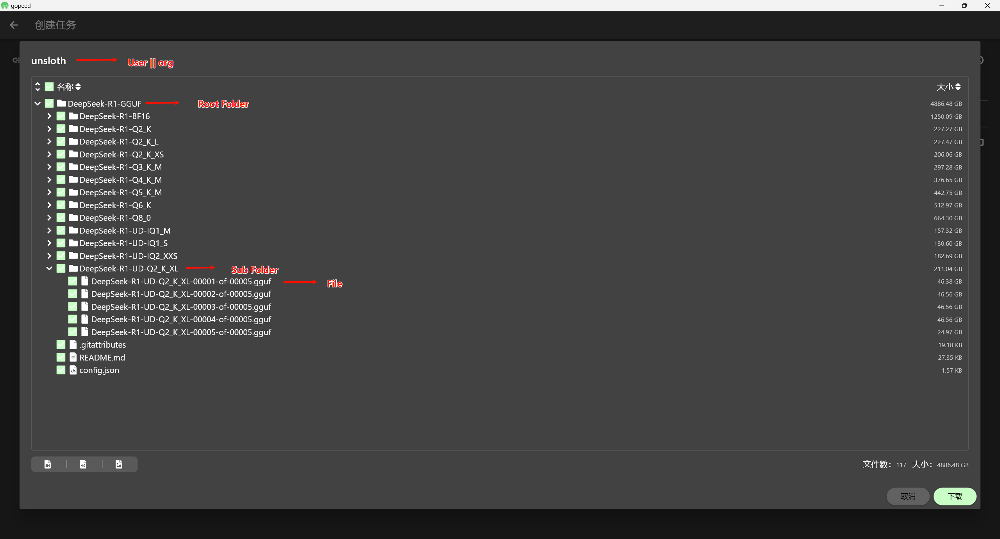

<!--
 * @Author: zayn 1546492103@qq.com
 * @Date: 2025-02-04 02:34:49
 * @LastEditors: zayn 1546492103@qq.com
 * @LastEditTime: 2025-02-25 12:13:36
 * @FilePath: \gopeed-extension-huggingface\README.md
 * @Description:
 *
-->

# Gopeed Extension Huggingface

[简体中文](readme/README.zh-CN.md) | [繁体中文](readme/README.zh-TW.md) | [English](README.md)

## Features

- ✅ Supports parsing entire folders of Huggingface models and datasets
- ✅ Supports parsing models and datasets with the same name on huggingface.co || hf-mirror.com || www.modelscope.cn, and freely specifying the source station
- ✅ Supports recursive parsing and automatically creates folders
- ✅ Supports setting Cookie to download Gated Repo
- ...

## Installation

Enter `https://github.com/DSYZayn/gopeed-extension-huggingface.git` on the plugin page to download and install

## Usage

Links in the following format can **parse all files in the folder**

`https://<baseUrl>/<user>/<repoType>/<repo>/tree/main/<path>`

- **baseUrl**: huggingface.co || hf-mirror.com || www.modelscope.cn
- **user**: username (organization name), e.g., deepseek-ai
- **repoType**: models || datasets
- **path**: folder path, leave blank if it is the root directory, remove the `/` at the end of `main/`

- 🔴 If using modelscope, the model or dataset must exist on huggingface, otherwise it cannot be parsed. (modelscope lacks an efficient and concise repository metadata API interface, welcome PR if needed)
- ❗ For individual files within a repository, enter the link you manually obtained, this plugin does not parse individual files.
- 🤷‍♂️ Parsing time depends on the depth of the directory and the number of files, typically completing most parsing within 3 seconds.

### Cookie Configuration

Some models require login to download (Gated Repo), in which case you need to configure the cookie, otherwise a `401` download failure will occur. The configuration method is as follows:

1. Get the cookie, open the browser, log in to `huggingface.co`, press `F12` to open the developer tools, switch to the `Network` tab, refresh the page, find the `https://huggingface.co` request, copy the value of the `Cookie` field
   

2. Enter the cookie in the extension settings
   

### Example

> To download using hf-mirror or modelscope, replace `huggingface.co` with `hf-mirror.com` or `www.modelscope.cn`, refer to `baseUrl`

1. Download the root folder files of unsloth/DeepSeek-R1-GGUF: `https://huggingface.co/models/unsloth/DeepSeek-R1-GGUF/tree/main`
2. Download the Deepseek-R1-BF16 folder of unsloth/DeepSeek-R1-GGUF: `https://huggingface.co/models/unsloth/DeepSeek-R1-GGUF/tree/main/Deepseek-R1-BF16`

tip: The `models/` in the above two links can be omitted

1. Download the root folder files of open-thoughts/OpenThoughts-114k: `https://huggingface.co/datasets/open-thoughts/OpenThoughts-114k/tree/main`
2. Download the data folder of open-thoughts/OpenThoughts-114k: `https://huggingface.co/datasets/open-thoughts/OpenThoughts-114k/tree/main/data`

tip: The `datasets/` in the above two links must not be omitted

## Demo

<!-- markdownlint-disable MD033 -->

1.  Input `https://hf-mirror.com/models/unsloth/DeepSeek-R1-GGUF/tree/main`

2.  Input `https://hf-mirror.com/unsloth/DeepSeek-R1-GGUF/tree/main/DeepSeek-R1-BF16`

3.  Input `https://hf-mirror.com/datasets/rubenroy/GammaCorpus-CoT-Math-170k/tree/main`

4.  Input `https://hf-mirror.com/datasets/ServiceNow-AI/R1-Distill-SFT/tree/main/v1`

5.  Input `https://huggingface.co/KwaiVGI/LivePortrait/tree/main`

<!-- markdownlint-disable MD033 -->

## Star History

